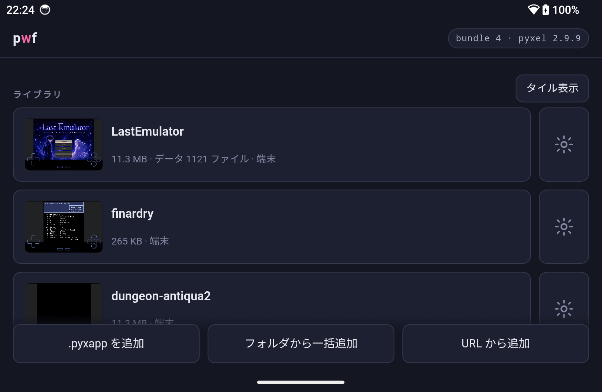
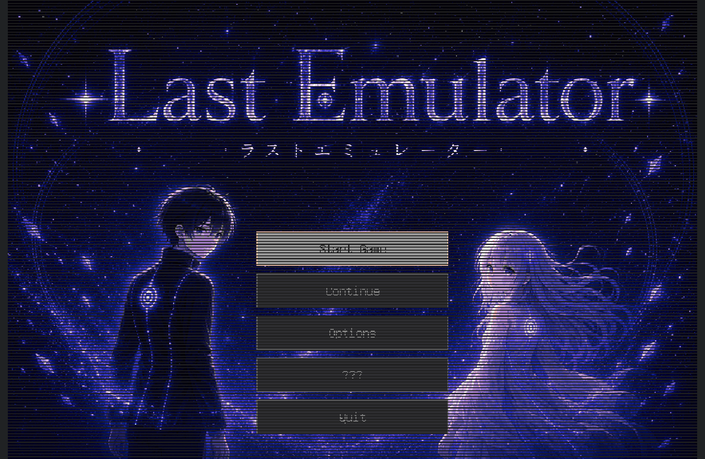
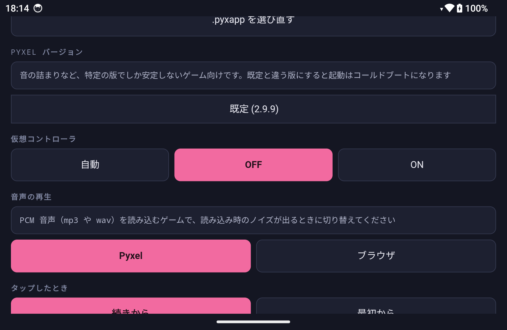
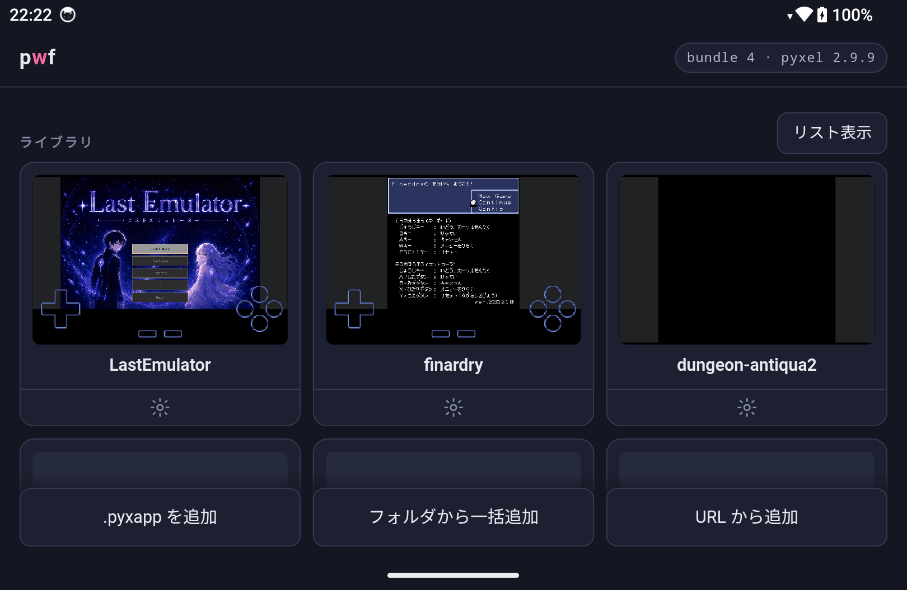
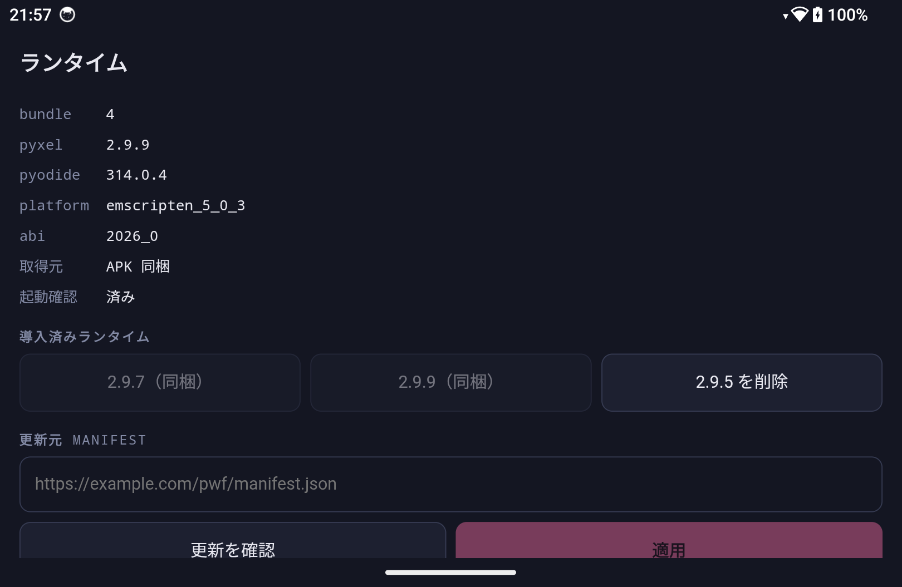

# pwf — 使い方

[English](usage.md) · [日本語](usage.ja.md) · [← README に戻る](../README.ja.md)

pwf は Android で Pyxel のゲームを動かすランチャーです。ブラウザもサーバーも
サインインも要りません。`.pyxapp` を端末に置いて、押すだけです。

## ゲームを入れる

方法は3つ、いずれも画面下にあります。

| | |
| --- | --- |
| **.pyxapp を追加** | ファイルを1つ選びます。 |
| **フォルダから一括追加** | フォルダを選ぶと、その直下にある `.pyxapp` をすべて取り込みます。中の assets フォルダは対象外です（後述）。 |
| **URL から追加** | ネットワークから取得します。 |

同じゲームを2度追加しても問題ありません。pwf はゲームを中身で見分けるので、
2回目は既にあるエントリに重なり、設定もデータフォルダも絵もそのまま残ります。

### .pyxapp と一緒にフォルダが付いてくるゲーム

`ゲーム名.pyxapp` と assets フォルダの組で配布されるゲームがあります。どの
フォルダがどのゲームのものかは推測できません（名付け方は作者ごとに違います）。
そこでゲームの ⚙ から **assets フォルダを追加** で指定してください。

大きなフォルダでも大丈夫です。コピーではなく貼り付けるだけで、中身はゲームが
実際に要求したときにはじめて読まれます。数百 MB あっても起動は重くなりません。

### 新しいビルドへの追従

ファイルから追加すると、pwf はその出どころを覚えます。**同じ場所に新しいビルドを
上書きすれば、次にライブラリを開いたときに自動で反映されます。** エントリも
セーブも設定もそのままで、登録し直す必要はありません。

この仕組みができる前に追加したゲームや、ファイルを移動した場合は、
⚙ → **.pyxapp を選び直す** で指定してください。その選択が追従の開始も兼ねます。

URL から追加したゲームはこの方法では追従しません。

## 遊ぶ

カードをタップするか、コントローラーで選んで A を押します。pwf を開いてから
最初の1本はランタイムの起動で数秒かかりますが、以降のゲームの切り替えは
ほぼ一瞬です。

ゲームから戻るのは**戻るボタン**です。既定ではゲームはライブラリの裏で動いた
ままなので、もう一度カードを押せば続きから再開します。うっかり戻るを押しても
失うものはありません。常に最初から始めたい場合は
⚙ → **タップしたとき** → **最初から**。

ゲーム内の QUIT や Pyxel の終了キーで終わったときは、自動でライブラリに戻ります。

## コントローラーで操作する

ゲームだけでなく、ランチャー自体もパッドで動かせます。

| | |
| --- | --- |
| 十字キー / 左スティック | 移動 |
| A | 決定 |
| B | 戻る（設定シートが開いていればそれを先に閉じます） |

フォーカス枠はパッドを使った時点で現れ、画面に触れると消えます。

Pyxel が出す **TOUCH TO START** の画面もボタンで抜けられるので、画面に手を
伸ばさずに起動できます。ゲームを選んだときのボタンがまだ押されたままなことが
多いため、この画面は目に入らないまま通り過ぎることがほとんどです。

ゲーム表示中、ランチャーはパッドを一切見ません。そこはゲームのものです。
抜けるのは戻るボタンです。

## ゲームごとの設定

以下はすべてカード横の ⚙ から、ゲームごとに設定できます。

| 項目 | 内容 |
| --- | --- |
| **データフォルダ** | このゲームの assets フォルダを結び付ける／外す。 |
| **更新** | 出どころのファイルを追従しているかの表示と、指定し直し。 |
| **セーブデータ** | 進行を zip に書き出す／読み戻す（後述）。 |
| **サムネイル** | カードの絵を消して、次に遊んだときに撮り直させる。 |
| **Pyxel バージョン** | このゲームを動かす Pyxel（後述）。 |
| **音声の再生** | `Pyxel`（通常）か `ブラウザ`（後述）。 |
| **仮想コントローラ** | `自動` は実機パッドを使うと消えます。`OFF` / `ON` は固定。 |
| **タップしたとき** | `続きから` / `最初から`。 |
| **ライブラリから削除** | エントリとデータフォルダとセーブを消します。2回押し。 |

### セーブのバックアップ

セーブはアプリの中にあります。つまり**アプリを消せば一緒に消えます**。
**書き出す** で zip として取り出し、**読み込む** で戻せます。

書き出し先のフォルダは最初の一度だけ選び、以降は記憶されます。`.pyxapp` を
置いているフォルダにしておくと、探すときに迷いません。

アーカイブには2種類が入ります。ゲームが書いたファイルと、ゲームによっては
そちらを使うブラウザ側の保存領域です。後者は**ゲーム単位ではなく全体で1つ**
なので、どの書き出しにも全ゲーム分が入り、1つ復元すると全ゲームの保存内容が
戻ります。他のゲームで新しく進めた後に古いアーカイブを戻すときは注意してください。

### Python パッケージ

ランタイムに無いものを import するゲームがあります（物理エンジンや画像処理など）。
その import で止まってしまい、ゲーム側からはどうにもできません。

⚙ → **Python パッケージ** → **不足しているモジュールを調べる** で、ゲームの
ソースを読み、インタプリタに「どれが見つからないか」を問い合わせ、足りないものを
取得ボタンとして並べます。取得すると、そのゲームで読み込む設定にもなります。

すでに止まったゲームなら、表示されるエラー画面に同じボタンがあります。

導入できるのは**このランタイム向けにビルドされた wheel** だけで、入手元は
Pyodide の配布物か PyPI です。そのビルドが存在しないものは導入できません。
これはこちらではどうにもなりません。

パッケージは **既定の Pyxel バージョン**向けに取得します。別の版に固定した
ゲームでは合わない場合があるので、効かないときは 既定 に戻してください。

取得したものはランタイム設定に一覧され、そこから削除できます。

### Pyxel のバージョンを選ぶ

既定では pwf に同梱の Pyxel で動きます。特定のゲームだけ調子が悪いとき
（多くは音まわりです）、プルダウンから 2.x の全リリースを選べます。端末に
無い版は選んだ時点で取得します。

同梱のインタプリタで動く版は約5MB、それより古い版は自前のインタプリタを
連れてくるので約20MB です。どちらかは選ぶ前に一覧に出ます。

既定と違う版を指定したゲームは、起動が数秒のコールドブートになります。同じ版
どうしの切り替えはこれまで通り一瞬です。

取得した版は、ランタイム設定からあとで削除できます。

### 音声

Pyxel はゲームと同じスレッドで音を作っています。そのため、再生中に曲を
読み込むゲームでは、その動作が「ブッ」というノイズとして聞こえることがあります。
**音声の再生** を **ブラウザ** にすると、その音をブラウザ側に渡し、
デコードをゲームの外に追い出します。

既定はオフで、上記の症状があるときだけ触れば十分です。すべてのゲームに効く
わけではありません。自前の音声処理を持つゲームはそもそも Pyxel を通らないので、
どちらでも変わりません。

## ライブラリの表示

**タイル表示 / リスト表示** で、1行1ゲームとタイル状の一覧を切り替えられます。
選択は記憶されます。

カードにはゲームの画面が出ます。絵の無いカードを遊んだとき、その数秒後に
撮られます。以降の起動では撮り直しません。ローディング画面で撮れてしまったら、
⚙ → **サムネイル** で削除してもう一度遊んでください。

## ランタイム設定

右上のチップから開きます。

- **導入済みランタイム** — 端末にある Pyxel の一覧。同梱のものは削除できません。
  あとから取得したものは削除して容量を戻せます。
- **更新元 manifest** — 新しいランタイムを配信している場合の URL。自分で
  配信していなければ空のままで構いません。
- **前のバンドルへ戻す** — ランタイム更新の取り消し。

起動に失敗したランタイムは、次回起動時に自動で巻き戻されます。

## うまくいかないとき

**ゲームが起動しない。** 何が起きたかを読める大きさで表示するようになりました。
`ModuleNotFoundError` と出ていれば、その画面のボタンから不足パッケージを探せます。
それ以外では、特定の Web ページ向けに作られ、そのページが提供する機能を前提に
しているゲームがあります。多くは対応済みですが、起動直後に落ちるようなら
ゲーム名を添えて教えてください。

**音が割れる、ノイズが入る。** まず **音声の再生 → ブラウザ**、それで駄目なら
**Pyxel バージョン** を変えてみてください。ブラウザエンジン上で Pyxel を動かす
以上どうにもならない部分もあります。詳しくは
[開発者向けドキュメント](development.ja.md#音はゲーム自身にやらせる)を参照してください。

**サムネイルが思った画面でない。** ⚙ → **サムネイル** で削除し、もう一度遊んでください。

**ゲームが assets を見つけられない。** ⚙ のデータフォルダが「なし」ではなく
ファイル数になっているか、そしてフォルダの中身ではなくフォルダ自体を指定したかを
確認してください。

**進行が消えた。** セーブはゲームに紐付いています。エントリを削除すると
セーブも一緒に消えます。同じファイルを再追加しても、削除していなければ戻りますが、
削除後は戻りません。大事なものは書き出しておいてください。
